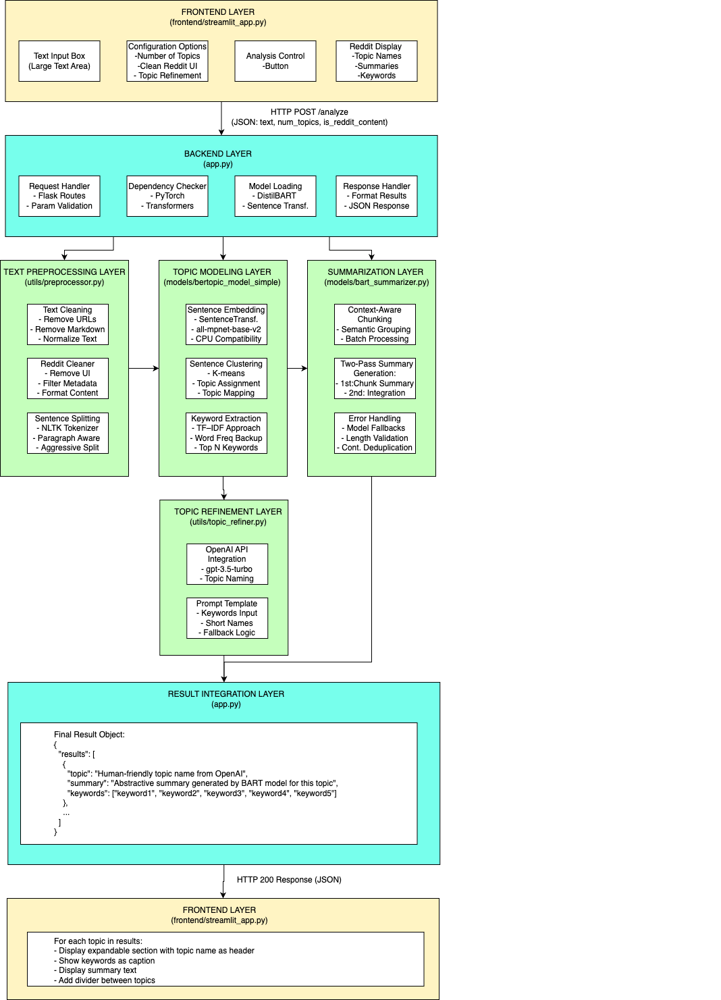

# TopicMind

**Version 1.1.0** - Topic extraction and summarization platform

## Overview
TopicMind extracts key topics from text content and generates concise, informative summaries. It uses a combination of natural language processing, topic modeling, and neural summarization techniques to analyze and distill information from large texts.

## Features
- Extract multiple topics from a single document
- Generate comprehensive summaries for each topic
- Process content from various sources (articles, Reddit threads, forums)
- Interactive web UI for easy use
- API for integration with other applications

## Getting Started

### Prerequisites
- Python 3.9+ 
- Required libraries (install via `pip install -r requirements.txt`)

### Running the Application
Simply use the start script:

```bash
./start_topicmind.sh
```

The script will:
1. Check for port conflicts and resolve them
2. Start the backend API server (port 5002)
3. Start the Streamlit frontend (port 8502)
4. Provide status information as services initialize

Access the web interface at http://localhost:8502

### API Endpoints
- `http://localhost:5002/health` - Check API health
- `http://localhost:5002/analyze` - Process and summarize text
- `http://localhost:5002/analyze_topics` - Extract topics from text
- `http://localhost:5002/summarize` - Summarize text without topic extraction

# TopicMind: Smart Text Summarization

<p align="center">
  
</p>

<p align="center">
  <a href="#features">Features</a> •
  <a href="#installation">Installation</a> •
  <a href="#usage">Usage</a> •
  <a href="#how-it-works">How It Works</a> •
  <a href="#text-preprocessing">Text Preprocessing</a> •
  <a href="#development-progress">Development Progress</a> •
  <a href="#performance-optimizations">Performance Optimizations</a> •
  <a href="#testing">Testing</a> •
  <a href="#development">Development</a> •
  <a href="#license">License</a>
</p>

TopicMind is an advanced text analysis tool that uses state-of-the-art NLP techniques to extract key topics and generate high-quality summaries from long-form text discussions. It's particularly effective for processing online discussions, forum threads, and comment sections where information is scattered across multiple messages.

## Features

- 🔍 **Smart Topic Extraction**: Identifies distinct topics in large text bodies
- 📝 **Context-Aware Summarization**: Groups related sentences for coherent summaries
- 🔄 **Two-Pass Summarization**: First summarizes chunks, then integrates them for overall context
- 🧠 **Domain-Agnostic Processing**: Works with diverse content (medical, tech, relationship advice, etc.)
- 🌐 **BERTopic Integration**: Automatically extracts topic names and keywords
- 🤖 **GPT-4o Quality Evaluation**: Optional automated assessment of summary quality
- 📱 **Modern Web Interface**: User-friendly Streamlit dashboard with export functionality
- 🔧 **Highly Configurable**: Adjustable parameters for fine-tuning the summarization process

## Installation

### Prerequisites

- Python 3.9+
- pip (Python package manager)

### Setup

1. Clone the repository:
   ```bash
   git clone https://github.com/SaiKrishna-KK/topic-mind
   cd topicmind
    ```

2. Create a virtual environment (recommended):
    ```bash
    python -m venv venv
   source venv/bin/activate  # On Windows, use: venv\Scripts\activate
    ```

3. Install dependencies:
    ```bash
    pip install -r requirements.txt
    ```

4. (Optional) For GPT-4o evaluation, add your OpenAI API key to a `.env` file:
   ```
   OPENAI_API_KEY=your_api_key_here
    ```

## Usage

### Web Interface

The simplest way to run TopicMind is using the included launch script:

```bash
./start_topicmind.sh
```

This script will:
1. Start the Flask backend server
2. Check that all models are loaded correctly
3. Start the Streamlit frontend
4. Provide a clean shutdown with Ctrl+C

Alternatively, you can start the components separately:

Start the backend service:

```bash
python app.py
```

Then in a new terminal:

```bash
streamlit run frontend/streamlit_app.py
```

Open your browser to http://localhost:8501 to access the web interface.

### Command Line

For direct testing or batch processing, use the test script:

```bash
python test_thread_pipeline.py --input your_text_file.txt
```

Advanced options:
```bash
# Test with specific parameters
python test_thread_pipeline.py --input reddit_thread.txt --chunk-size 5 --max-sentences 15

# Test without final compression (single-pass summarization)
python test_thread_pipeline.py --input reddit_thread.txt --no-compression

# Batch testing across multiple content types
python test_thread_pipeline.py --batch-test
```

## How It Works

TopicMind uses a multi-stage pipeline to process text:

1. **Preprocessing**: Cleans and normalizes text, handling Reddit-specific formatting if needed
2. **Topic Extraction**: Uses BERTopic to identify key themes in the content
3. **Sentence Refinement**: Selects the most relevant sentences for each topic
4. **Context-Aware Chunking**: Groups semantically related sentences together
5. **Two-Pass Summarization**: 
   - First pass: Summarizes each chunk independently
   - Second pass: Integrates chunk summaries into a coherent final summary
6. **Quality Evaluation**: (Optional) Uses GPT-4o to assess summary quality



## Pipeline Architecture

The TopicMind pipeline processes text through several specialized components:

1. **Text Cleaning (Preprocessor)**: Handles Reddit-specific formatting, removes UI elements, and standardizes text
2. **Topic Extraction (BERTopic Model)**: Sentence embedding and clustering to identify key themes
3. **Thread Refiner**: Selects contextually important sentences for each topic
4. **Chunking Engine**: Groups related sentences for more coherent summaries
5. **BART Summarizer**: Two-pass summarization system for high-quality output
6. **Evaluation Module**: Optional GPT-4o assessment of summary quality

### Data Flow

```
Raw Text → Preprocessor → Topic Extractor → Thread Refiner → 
  → Chunking Engine → First-Pass Summarization → Second-Pass Integration → Final Summary
```

Each component maintains provenance tracking to ensure the original context is preserved throughout processing.

## Text Preprocessing

The text preprocessing module is a critical component that prepares raw text for effective analysis:

### Preprocessing Steps

1. **Initial Cleaning**
   - Removes HTML tags, URLs, and special characters
   - Normalizes whitespace and line breaks
   - Fixes common encoding issues
   
2. **Reddit-Specific Processing** (when enabled)
   - Strips UI elements like upvote counts (e.g., "[+123]")
   - Removes username mentions and timestamp markers
   - Cleans up formatting artifacts from Reddit's markdown
   - Preserves important formatting like paragraphs and lists

3. **Sentence Segmentation**
   - Splits text into sentences using NLTK's sentence tokenizer
   - Preserves sentence context and relationships
   - Handles special cases like bulleted lists and quotes

4. **Noise Filtering**
   - Removes sentences that are too short (< 5 words)
   - Filters out sentences with very little information content
   - Eliminates duplicate or near-duplicate sentences

5. **Semantic Enrichment** (when enabled)
   - Computes semantic embeddings for sentences
   - Enhances content relevance determination
   - Improves topical grouping through semantic similarity

Each preprocessing step is configurable via the UI or command-line options, allowing users to tailor the pipeline to specific content types.

## Performance Optimizations

TopicMind has been optimized for performance and usability with several key improvements:

### UI Performance Enhancements

1. **Progress Tracking**
   - Added real-time progress bars and status updates in the Streamlit UI
   - Implemented step-by-step status reporting during long operations
   - Created a clear visual indication when processing multi-stage operations

2. **Development Mode**
   - Added a "Dev Mode" toggle to limit processing for faster testing
   - Restricts chunk processing to a maximum of 3 chunks in development mode
   - Provides clear indication when processing is limited

3. **Model Caching**
   - Implemented efficient caching for the Sentence Transformer model
   - Single load at application startup rather than per-request loading
   - Reduced redundant embedding calculations through caching

4. **Streamlined UI**
   - Removed documentation sidebar for a cleaner, more focused interface
   - Fixed nested expander compatibility issues by using tabs
   - Improved error handling and user feedback


### Advanced Features in the UI

TopicMind allows customization of how topics are labeled and how summaries are generated through optional input fields in the Streamlit interface.


##### Custom Summarization Prompt

Enable:

> "Use custom summarization prompt"

You may insert `{topic}` in your prompt, which will automatically be replaced by the actual topic name during summarization.

##### Example:

```
Summarize the following discussion about {topic} into 2–3 clear sentences.
```

If no prompt is provided, the system auto-generates one using the topic's keyword cluster.

---

#### Manual Topic Name Input

Enable:

> "Set custom topic names"

This feature allows users to provide their own **topic names manually** — useful when they already know the thematic structure or want full control over labels.

If enabled, the system will **ignore BERTopic-generated names** and use the ones entered by the user.

##### Example:

You can type:

```
Career Transitions
Healthcare Stories
Productivity Hacks
```

These names will be applied in the order of topics detected.

### Backend Optimizations

1. **Efficient Embedding Generation**
   - Cached sentence embeddings to prevent redundant calculations
   - Implemented batch processing for embedding generation
   - Reduced memory usage through optimized tensor handling

2. **Selective GPT Integration**
   - Made OpenAI API integration optional with graceful fallbacks
   - Disabled GPT evaluation by default to improve response time
   - Added configurable topic refinement that only uses OpenAI when available

3. **Chunking Optimizations**
   - Implemented more efficient context-aware sentence chunking
   - Enhanced deduplication to prevent redundancy across chunks
   - Optimized chunk sizes based on content complexity

## Development Progress

### Recent Enhancements

#### Enhanced Thread Refiner
- Created `utils/thread_refiner.py` as a generalization of the Reddit semantic refiner
- Added sentence provenance tracking with unique hash IDs
- Made refiner model-agnostic with optional model parameter
- Ensured backward compatibility with previous functions
- Added JSON logging of sentences with provenance information

#### Improved BART Summarizer with Chunk-Based Processing
- Updated `models/bart_summarizer.py` to support sentence dictionaries with provenance
- Added chunk-based summarization for long sentence lists
- Implemented intelligent sentence chunking and summary merging
- Modified summarization to track sentence provenance
- Added a backward-compatible `summarize_text()` facade method
- Updated logging to improve visibility of chunking process

#### UI Enhancements
- Added "Enable semantic refinement" toggle
- Implemented progress tracking for long-running operations
- Added dev mode for faster testing
- Improved error handling and feedback
- Created a cleaner, more focused interface

#### Pipeline Improvements
- Implemented sentence provenance tracking through the entire pipeline
- Added chunk-based summarization with configurable chunk size
- Created model-agnostic design that accepts external models
- Enhanced logging and evaluation

### Summarizer Evolution

The summarization system has evolved through several iterations:

1. **Initial TF-IDF + DistilBART Implementation**
   - Keyword-based sentence filtering
   - Basic single-pass summarization

2. **Enhanced Two-Pass System**
   - First pass: Summarize content chunks
   - Second pass: Integrate chunk summaries

3. **Context-Aware Architecture**
   - Semantic chunking based on content relationships
   - Enhanced deduplication across chunks
   - Improved sentence selection

4. **Full Pipeline Integration**
   - Seamless flow from preprocessing to final summary
   - Comprehensive logging and evaluation
   - Configurable parameters throughout the pipeline

### Example Summaries

#### Machine Learning Topic

```
Machine learning is transforming how we interact with technology. Ethical considerations should be central to AI development. Data collection practices need more transparency according to critics. The benefits of AI are vast, from healthcare to climate science.
```

#### Gaming Community Topic

```
Reddit discussions on gaming often focus on new releases. Nostalgia for classic games is a common theme in gaming subreddits. Competitive gaming and esports have growing discussion communities. Mobile gaming is sometimes viewed with skepticism by traditional gamers.
```

## Testing

TopicMind includes a comprehensive testing framework to verify performance across different content types and with various configuration settings.

### Quick Test Commands

```bash
# Test with default settings (auto-generated topic name)
python test_thread_pipeline.py --input reddit_thread.txt

# Test with a specific chunk size
python test_thread_pipeline.py --input reddit_thread.txt --chunk-size 5

# Test without final compression (no second pass summarization)
python test_thread_pipeline.py --input reddit_thread.txt --no-compression

# Test with a custom prompt
python test_thread_pipeline.py --input reddit_thread.txt --prompt "Summarize this discussion clearly in 2-3 sentences:"
```

### Batch Testing

The script supports batch testing across multiple thread types:

```bash
# Run tests on multiple files with auto-generated topic names and prompts
python test_thread_pipeline.py --batch-test
```

This will test against:
- `reddit_thread_medical.txt` 
- `reddit_thread_relationship.txt`
- `reddit_thread_career.txt`
- `reddit_thread_gaming.txt`

### Test Features

The enhanced testing pipeline includes:

1. **Domain-Agnostic Prompt Generation**: Tests how prompts are generated for different content types
2. **Topic Name Fallback**: Tests the system's ability to generate names automatically
3. **Comprehensive Logging**: Captures generated prompts, topic names, and evaluation scores
4. **Quality Assessment**: Uses GPT-4o to evaluate summaries on clarity, coherence, and relevance

### Reviewing Test Results

After running tests, check:

1. **Console Output**: Shows prompts used, summaries generated, and evaluation scores
2. **Log Files**:
   - `logs/summaries/final/enhanced_pipeline_result_*.json`: Complete JSON results
   - `logs/eval/reports/enhanced_pipeline_report_*.txt`: Human-readable report
   - `logs/summaries/chunks/chunk_pass_log_*.json`: First-pass chunk summaries
   - `logs/summaries/final/final_summary_pass_*.txt`: Final summary details

## Examples

### Medical Discussion Summary

**Input**: A lengthy Reddit thread about sepsis symptoms and warning signs

**Output**:
```
Red streaks near a wound, particularly on the limbs, can indicate a spreading infection and may be an early sign of sepsis. Sudden onset dementia, especially in old women and diaper wearers, might be the only symptom of a bladder infection that can lead to sepsis if untreated.
```

### Relationship Advice Summary

**Input**: A discussion about relationship communication issues

**Output**:
```
Wedding planning often reveals deeper issues in relationships because it involves money, family dynamics, personal values and the ability to problem-solve together. If he regularly dismisses your opinions and preferences, you might want to reconsider the whole relationship, not just the wedding plans.
```

### Gaming Recommendations Summary

**Input**: A thread discussing PlayStation 5 vs PC gaming

**Output**:
```
Don't let FOMO (fear of missing out) on a hypothetical PS5 Pro rob you of 1-2 years of great gaming. The regular PS5 already runs everything beautifully, and by the time the Pro comes out, we'll be 2+ years closer to PS6.
```

## Development

### Project Structure

```
topicmind/
├── app.py                     # Flask backend
├── frontend/
│   └── streamlit_app.py       # Streamlit UI
├── models/
│   ├── bart_summarizer.py     # Summarization model
│   ├── bertopic_model_simple.py # Topic extraction model
│   ├── lda_model.pkl          # Pre-trained LDA model
│   └── lda_dictionary.pkl     # Dictionary for LDA model
├── utils/
│   ├── preprocessor.py        # Text cleaning utilities
│   ├── thread_refiner.py      # Content filtering
│   ├── reddit_semantic_refiner.py # Reddit-specific refiner
│   ├── topic_refiner.py       # Topic refinement tools
│   └── organize_logs.py       # Log organization utility
├── tests/
│   ├── test_thread_pipeline.py # Testing pipeline
│   ├── test_summarizer.py     # Summarizer tests
│   ├── test_semantic_refiner.py # Refiner tests
│   ├── ui_test.py             # UI testing
│   └── api_test.py            # API testing
├── prompts/
│   └── refine_topic.gpt.txt   # GPT prompt templates
├── data/
│   └── reddit_sample.json     # Sample data for testing
├── start_topicmind.sh         # Startup script
└── logs/                      # Organized log directories
    ├── gpt/                   # GPT evaluation logs
    ├── semantic/              # Semantic processing logs 
    ├── summaries/             # Generated summaries
    ├── eval/                  # Evaluation reports
    ├── pipeline/              # Pipeline process logs
    └── streamlit/             # UI-related logs
```

### Log Organization

The project includes a log organization utility that keeps all output files neatly structured:

```bash
python utils/organize_logs.py
```

This will organize logs into appropriate subdirectories and create an index for easy browsing.

### Contributing

1. Fork the repository
2. Create a feature branch: `git checkout -b new-feature`
3. Make your changes
4. Test thoroughly
5. Submit a pull request

## License

MIT License - see [LICENSE](LICENSE) file for details.

## Acknowledgements

- Thanks to the creators of BERTopic, DistilBART, and other open-source models used in this project
- GPT-4o evaluation capability powered by OpenAI's API

---

<p align="center">
Made with ❤️ by [Your Name]
</p> 
