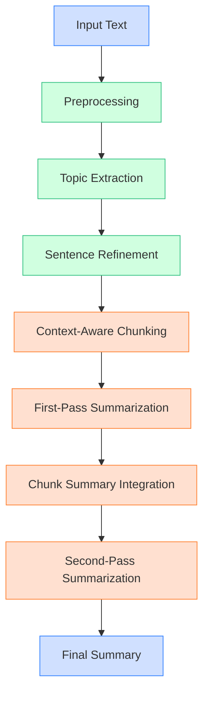

```mermaid
graph TD
    A[Input Text] --> B[Preprocessing]
    B --> C[Topic Extraction]
    C --> D[Sentence Refinement]
    D --> E[Context-Aware Chunking]
    E --> F[First-Pass Summarization]
    F --> G[Chunk Summary Integration]
    G --> H[Second-Pass Summarization]
    H --> I[Final Summary]
    
    style A fill:#d0e0ff,stroke:#3080ff
    style B fill:#d0ffe0,stroke:#30c080
    style C fill:#d0ffe0,stroke:#30c080
    style D fill:#d0ffe0,stroke:#30c080
    style E fill:#ffe0d0,stroke:#ff8030
    style F fill:#ffe0d0,stroke:#ff8030
    style G fill:#ffe0d0,stroke:#ff8030
    style H fill:#ffe0d0,stroke:#ff8030
    style I fill:#d0e0ff,stroke:#3080ff
``` 